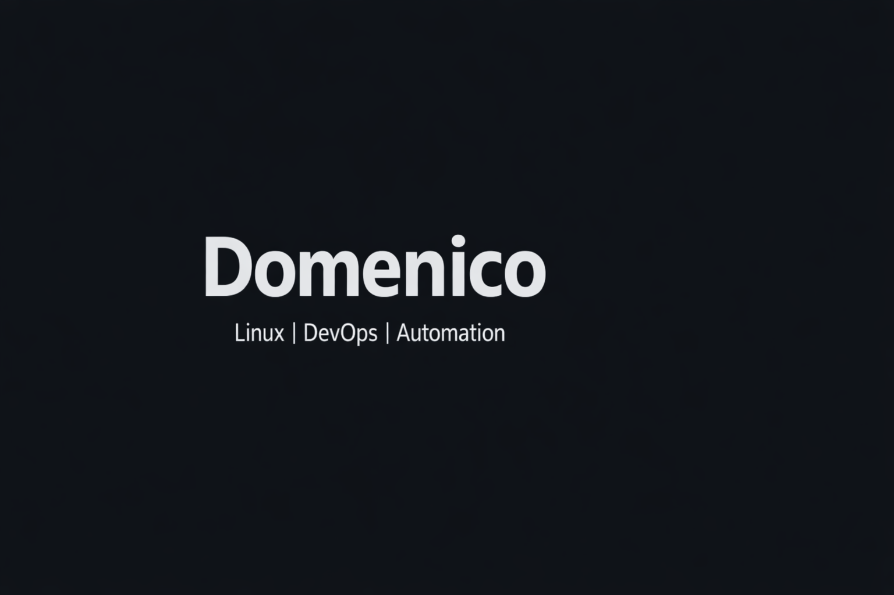

  

# Domenico Iavarone

Linux System Engineer | DevOps | Infrastructure & Automation

---

## 👨‍💻 About Me

System engineer with 13+ years of experience working on Linux environments, infrastructure design and automation.

I focus on building reliable systems, reducing manual work through automation and designing clean, reproducible environments.

---

## 🔧 Core Skills

* Linux Systems Administration (Ubuntu, Debian)
* Virtualization (Proxmox VE)
* Containerization (Docker)
* Automation (Ansible)
* CI/CD pipeline design
* Monitoring & Observability (Prometheus, Grafana)
* Networking & troubleshooting

---

## 🚀 Current Work

* Designing a **Proxmox homelab cluster** with ZFS replication
* Building a **container-based CI/CD platform**
* Structuring **Infrastructure as Code workflows**

---

## 📂 Projects

> Focused on real-world infrastructure and DevOps scenarios.

* 🔹 homelab-proxmox-cluster *(in progress)*
* 🔹 devops-ci-cd-platform *(in progress)*
* 🔹 monitoring-stack *(planned)*

---

## 🧠 Engineering Approach

* Automation first
* Keep it simple and maintainable
* Prefer reproducibility over quick fixes

---

## 📫 Contact

* www.linkedin.com/in/domenico-iavarone-2a17ab36
